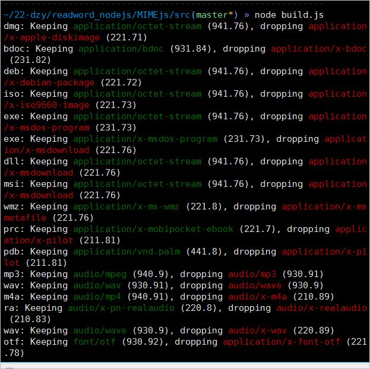
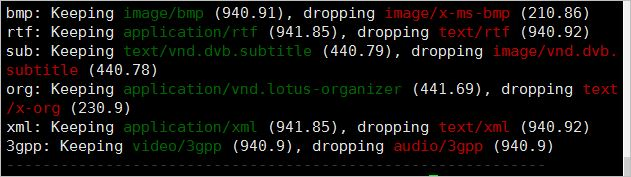
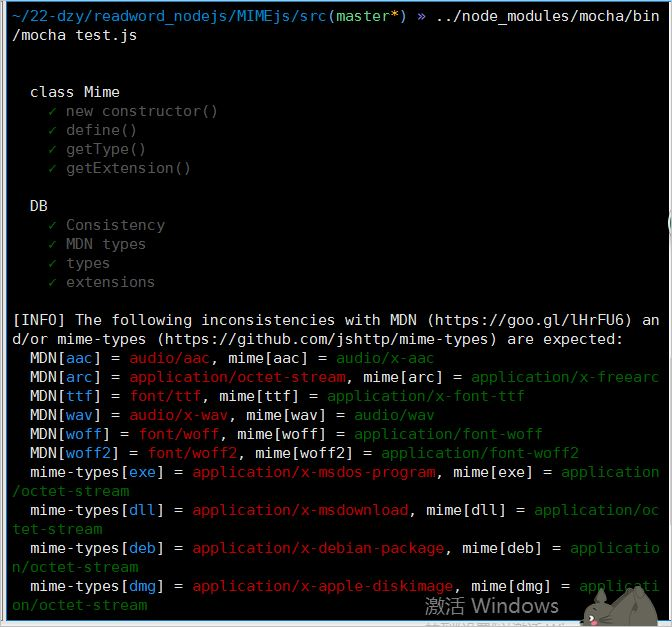
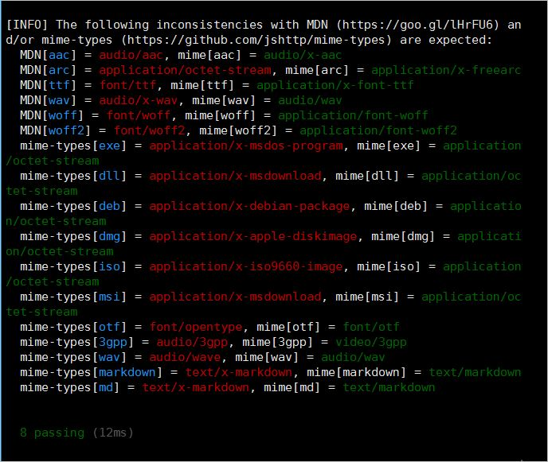

# node-mime代码解读成果展示
## 一、代码仓库展示

#### 名称：node-mime

#### 功能：用来设置某种扩展名的文件的用一种应用程序来打开的方式类型,当指定扩展名文件被访问时，浏览器会自动使用指定应用程序来打开.多用于指定一些客户端自定义的文件名，以及一些媒体文件打开方式.

#### 地址：[https://zhangna3moli.github.io/node-mime](https://zhangna3moli.github.io/node-mime)

>- MIME：Multipurpose Internet Mail Extensions，多用途互联网邮件扩展类型
>- mime模块是一个基于mime-db的MIME类型解析及处理程序。mime从v2起，是一个与mime-db数据集的预优化版本捆绑在一起的独立模块
>- 当指定扩展名文件被访问时，浏览器会自动使用指定应用程序来打开。在HTTP中，是通过名为Content-Type的HTTP头来设置或响应对应的文件类型的。例如：当服务器要向客户端发送的内容图类为.jpg图片，就需要将Content-Type头设置为image/jpeg，而客户端同样会根据Content-Type对服务器内容进行解析。
MIME和Content-Type是文件类型设置和解板的标准。当服务器要对某种扩展名文件发送到客户端时，会根据文件扩展名设置Content-Type头。而客户端（可以认为是浏览器），对服务器内容进行解析时也需要Content-Type所代表的MIME找到内容的解析程序。MIME类型非常多，当我们在服务端设置发送内容格式时或当我们对服务端内容进行解析时，对几百种MIME类型进行处理工作量会非常巨大。
推荐一个NPM包：mime。mime模块使用Apache项目的mime.types文件,该文件包含了超过600个Content-Type类型数据，并且支持添加自定义的MIME类型。

#### 仓库包含文件及作用

> index.js 和 lite.js

其中暴露的函数作为第三方模块引用

> cli.js

CLI(Command Line  Interface for batch scripting)命令行界面批处理脚本
获得给定路径或扩展的MIME类型打印出来显示在屏幕上

> Mime.js  

定义mime类型->扩展名的映射  

> build.js

去掉在mime-db中的扩展冲突，建立mime类型->扩展映射的标准与非标准文件

> README.md 

对项目作描述和说明

> .gitignore

用来排除不必要的项目文件或敏感信息文件，在此文件中写入的文件不会被提交到远程仓库

> LICENSE

文件统一用的MIT共享协议

> package.json

存储工程的元数据，描述项目的依赖项，类似配置文件。

项目依赖项：

chalk: 命令行彩色输出（终端字符串样式正确）

eslint: 一个基于AST的模式检查器的JavaScript。

github-release-notes: Github发行说明和更新日志生成器.从标签创建发行版,并使用问题或提交来创建发行说明.也可以                       根据发行说明生成一个CHANGELOG.md文件（或者生成一个全新的）。

mime-db: 媒体类型数据库.它是所有MIME类型的数据库。它由一个单一的公共JSON文件组成，不包含任何逻辑，允许它尽可          能保持与API无关。它汇总了以下来源的数据：

>- [http://www.iana.org/assignments/media-types/media-types.xhtml(http://www.iana.org/assignments/media-types/media-types.xhtml)
>- [http://svn.apache.org/repos/asf/httpd/httpd/trunk/docs/conf/mime.types](http://svn.apache.org/repos/asf/httpd/httpd/trunk/docs/conf/mime.types)
>- [http://hg.nginx.org/nginx/raw-file/default/conf/mime.types](http://hg.nginx.org/nginx/raw-file/default/conf/mime.types)

mime-types: 最终的JavaScript内容类型的实用工具。和mime类似，除了以下几点不一样，否则和API是兼容的。
 
>- 不支持回退。并不是本机返回第一个可用的类型， mime-types只返回false，所以可以var type = mime.lookup('unrecognized') || 'application/octet-stream'。
>- 没有new Mime()，所以可以var lookup = require('mime-types').lookup。
>- 没有.define()功能
>- 错误修复 .lookup(path)

runmd: 可运行的README文件,在markdown中运行代码块并用输出注释它们。
      使用runmd,,您的读者可以相信您的代码块是可运行的，代码输出将被声明。

mocha：自动化测试工具

> test文件夹

包含test.js文件，对Mime.js进行mocha自动化测试

> docs文件夹

存放项目文档

## 二、代码解读
### 1.README.md文件解读
项目分类：第三方模块
### 2.index cli lite Mime build文件解读

#### 数据结构种类：

字符串：类型判断，值判断，赋值等

数组：提供索引、遍历等工具接口

对象：作为函数返回值，作为对象的属性，类型判断等

类：作为对象的模板,会默认添加constructor方法

#### 项目中运用的JavaScript语法

- ES6中的let与const

> 其与var的不同在于，用let声明的变量只在 let 命令所在的代码块 { }内有效使用,let声明变量，可有效避免变量共享缺陷

- ES6中提供的新的语法规则 箭头函数=>来描述函数

> 箭头函数中的this是与函数定义时所在的对象绑定，而不是使用的对象绑定，避免this缺陷

- 正则表达式

> 用来检索、替换那些符合某个模式(规则)的文本。

#### 设计模式种类：

代码分块

代码模块 | 是否为暴露模块|描述
---|---|---
var,require | |全局变量定义和引入第三方模块
exports | |暴露模块
define(typeMap, force) |是|定义类型到扩展的映射
getType(path)|是|获取给定路径或扩展的MIME类型
getExtension(type)|是|返回mime类型对应的文件扩展名
writeTypesFile(types, path)|否|在指定路径创建文件内容

执行过程

## 三、mocha测试

